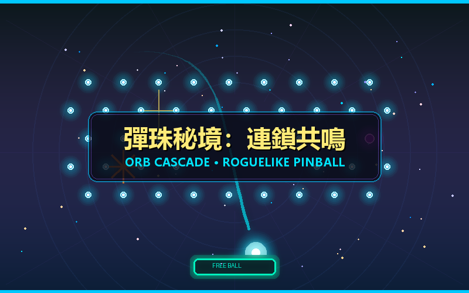

# 《彈珠秘境：連鎖共鳴》(Orb Cascade)



> **遊戲類型**：物理彈射 × 柏青哥 (Pachinko) 連鎖消除 × 肉鴿遺物 (Physics Ricochet Roguelike)  
> **版本**：v1.0.0  
> **平台規範**：Playroom Platform

---

## 遊戲簡介

《彈珠秘境：連鎖共鳴》是一款融合了剛體彈射物理、柏青哥連鎖消除與肉鴿遺物技能構建的奇幻街機遊戲。
玩家操控頂部魔法砲台，在精確的 3 次折射物理預測下瞄準發射魔法彈珠，墜入佈滿機關的神秘釘盤。

- **音階木琴連鎖**：每次碰撞隨著 Combo 攀升奏響木琴五聲音階，最高帶來 5.0x 傷害倍率！
- **豐富機關互動**：弱點釘爆擊 (Crit)、彈跳魔菇 (Bouncer)、TNT 炸藥桶廣度優先引爆、雙向傳送門與重置金釘。
- **底部移動集球桶**：抓住機會接住彈珠，獲得「FREE BALL」免費球與額外魔能獎勵。
- **10 層地下城挑戰**：對抗從史萊姆到混沌虛空古龍的 10 層守衛，怪物倒數完畢會反擊玩家血量！
- **12 款精選肉鴿遺物**：每層擊破後隨機三選一，構築分裂球、連鎖閃電、引力黑洞等獨特流派。
- **零外部音訊資產**：100% 使用 Web Audio API 即時程序化合成音效與奇幻 BGM，極速秒開，無版權困擾。

---

## 操作指南

- **瞄準**：滑鼠拖曳或手機螢幕觸控滑動調整發射角度，預測虛線將即時呈現反射路徑。
- **發射**：鬆開滑鼠或手指即可射出魔法彈珠。
- **介面按鈕**：點擊靜音按鈕切換音效，通關或失敗後可一鍵重新挑戰。

---

## 本機開發與建置

```bash
# 安裝依賴
npm install

# 本機開發模式
npm run dev

# 靜態打包
npm run build
```

打包輸出目錄為 `dist/`，包含 `index.html`, `game.json`, `cover.png`, `playroom-sdk.js` 及編譯後的資產。
